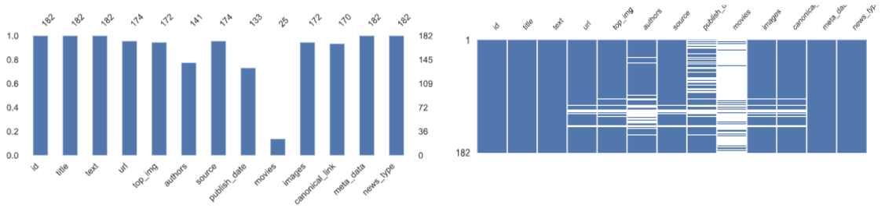
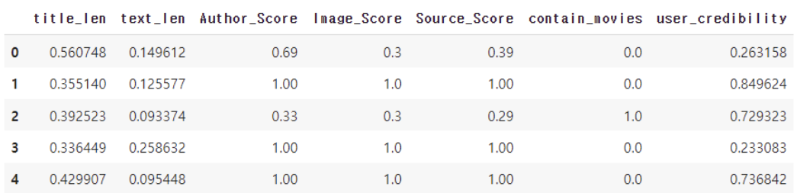

# fakenews-classification

# 📚개요
## 1. 배경 및 주제

    

SNS의 발달로 정보 전파속도가 매우 빨라 가짜뉴스의 검증이 이루어지기 전, 먼저 정보가 전파되는 문제가 발생하고 있다.
 
따라서, SNS상의 정보와 퍼져나가는 양상을 바탕으로 가짜뉴스와 진짜 뉴스를 판단하는 분석 모델을 만들어 가짜 뉴스를 구분한다.

 

**가짜뉴스 특징**
- 끊임없는 재생산
- 서로 연결되지 않은 개인에 의한 전파 / 점 조직의 네트워크 형태
    - Graph(Network) 이용
- 빠른 확산 속도
- 주로 팔로워가 적은 사람에서 많은 사람으로 전파되는 양상
    - Graph(Network) 이용
- 회피성 언어 사용 
    - Text(텍스트마이닝) 이용

## 2. 프로젝트 일정

    

## 3. 분석 프레임워크

    

## 4. 데이터 설명
txt : 트위터에서 공유되는 각종 뉴스 기사들의 retweet 데이터

csv : 해당 기사의 진위여부 데이터

    

 

# 💻 분석 프로세스

## 1.EDA

 <b> 테이블(CSV) 데이터 </b> 

	
- 기술통계량

    

- 결측치  

    

- 막대 그래프  

    

  

 <b> 텍스트(TXT) 데이터 </b> 

	
- title 변수의 길이, 토큰 수, 토큰 길이

    

- text 변수의 길이, 토큰 수, 토큰 길이   

    

- title, text 변수 REAL/FAKE 뉴스 품사 통계  

    

- 기사 본문 품사가 동사, 형용사, 부사인 빈도 수 상위 50개 단어  

    

  
  

## 2.데이터 전처리
- eda를 근거로 불필요한 변수를 제거 및 유의미한 새로운 변수 생성

    

 <b> 기존 변수 이용한 파생 변수 생성 </b> 

- author, images, source 세가지 변수 이용하여 파생 변수 생성

    

	

    

- author 개인의 fake/real news 작성 횟수를 고려해 점수 부여
(author의 신뢰도)

- 각 뉴스별 author 신뢰도의 평균 
→ author score 변수 생성

- images, source 또한 같은 방식으로 진행
  

 <b> 네트워크를 이용한 파생 변수 생성 </b> 

	
- 팔로우-팔로워 네트워크 이용하여 파생 변수 생성

    

    

- 팔로워가 적은 사람에서 많은 사람으로 전파되는 경우가 많음
    - → 뉴스를 리트윗 하는 유저의 in-degree와 out-degree를 비교

- 서로 연결되지 않은 개인에 의해 전파, 점 조직 형태의 네트워크를 가짐
    - → 뉴스를 리트윗 하는 유저의 clustering-coefficient를 비교

- 가짜 뉴스를 리트윗 하는 유저들은 가짜 뉴스를 전파하기 위함
    - → 뉴스를 리트윗 한 유저들의 진짜 뉴스, 가짜 뉴스 수 비교
  

  
  

 <b> 수치형 변수 선택 </b> 

	
- 수치형 변수 분포 비교

    

→ in_out_degree, clustering_coef 변수가 가설과 달리 Fake일 때 더 높은 값의 분포를 가짐

- 수치형 변수 t 검정, 범주형 변수 Chi2 검정

    

→ 신뢰구간 90%일 때 -> in_out_degree 채택 / 신뢰구간 95%일 때 -> text_len, in_out_degree 채택

→ 분석 목적에 맞지 않는 in_out_degree, clustering_coef 변수 제거

- 최종 데이터셋에 포함될 수치형 변수 결정

    

  
  

## 3.데이터 분석

 <b> 머신러닝 </b> 

	
- 데이터 스케일링

    

→ 범주형 변수 contain_movies 를 유지하기 위해 minmaxscaler 사용 
 

- 모델 선택 및 분석
  

    

→ 로지스틱 회귀, 랜덤포레스트. MLP모델을 이용하여 분석 진행 
→ 다중공선성의 문제를 방지하기 위해 로지스틱 모델은 L2 규제를 통해 릿지회귀를 이용 
 

- K-Fold 교차 검증  

    

→ 모델이 테스트셋에 과적합 되었을 수 있으므로 K-Fold 교차 검증 진행 
 

- 특성 중요도
  

    

→ 랜덤포레스트 모델 분류에서 특징이 얼마나 영향을 미치는지 특징 중요도를 확인 
→ user_credibility 변수가 분류에 가장 큰 영향을 주었고 다음으로 score 변수들의 영향이 큼 
 

 <b> 텍스트 분석 </b> 

	
- 자연어 처리 분석 프레임워크

    

→ 텍스트 변수인 title과 text 병합한 뒤, 토큰화 및 불용어 제거  
→ 가짜 뉴스의 특성 중 "모호한 언어 사용"을 이용하기 위해 동사,형용사, 부사 토큰만을 추출하여 BoW, TF-IDF를 생성한 뒤 분석 수행
 
 

- 모델 선택 및 분석
   

    

→ MLP, 랜덤 포레스트. 로지스틱 회귀, 나이브 베이즈 분류 모델 이용  
→ 전체 토큰보다 동사, 형용사, 부사 토큰만으로 분석을 진행한 경우 성능이 더 높음
 
 

- 하이퍼 파라미터 튜닝
  

    

→ 하이퍼 파라미터 튜닝 진행한 모든 모델의 성능이 향상 
 
  

 <b> 결과 </b> 

	
- 결과 비교

    

→ 자연어처리: 동사, 형용사, 부사를 사용해 랜덤포레스트 모델을 이용했을때 가장 높은 성능

→ 머신러닝: 랜덤포레스트 모델을 이용했을때 가장 높은 성능

→ 자연어처리 보다 머신러닝이 더 높은 성능을 보이지만 자연어처리도 충분히 높은 성능을 보임
 

- 결론
   

    

→ 가짜 뉴스의 서로 연결되지 않은 개인에 의한 전파 특성: 

clustering coefficient의 비교로 나타냄 -> 기각

→ 팔로워가 적은 사람에서 많은 사람으로 전파되는 양상:  
in-out degree 비교로 나타냄 -> 기각

→ 회피성 언어 사용 특성:  
전체 텍스트 토큰 vs 동사, 형용사, 부사의 토큰만 이용한 자연어 처리 성능 비교를 통해 유의미한 결과 도출

→ 진짜 뉴스와 가짜 뉴스의 빈도 수 차이를 통해 생성한 파생변수들 모두 유의미

 

- 고도화 방안
  - 파생변수의 scoring 방식 개선  
  → 과거에 진짜 뉴스, 가짜 뉴스 둘 중 하나만 나타났을 때 횟수를 비교하지 못하는 한계 존재  
  ex. (진짜 뉴스 빈도수, 가짜 뉴스 빈도수) 라고 하면 (32,0)과 (9,0)이 같은 값 1로 scoring
  - 자연어처리와 머신러닝을 함께 고려하여 분류하는 방법 탐색  
  → 두 방법을 따로 비교해야하는 한계 존재  
  → 앙상블과 같이 두 방법을 함께 고려하여 분류하는 방법을 탐색
  - 네트워크에서 추가로 유의미한 인사이트 탐색  
  → 뉴스의 특성이 잘 나타나는 유저 간의 관계 데이터 필요   
  → 뉴스의 확산 양상을 표현할 수 있는 보다 정교한 데이터 필요.

  

